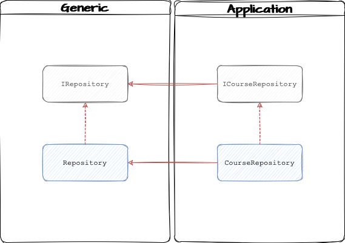
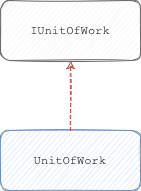

# Repository Pattern

Repository Pattern in Dotnet Core using Entity Framework

## What is repository pattern?

Repository mediates between the domain and data mapping layers, acting like an in-memory collection of domain objects.

## Benefits

- Minimizes duplicate query logic
- Decouples the application from persistence frameworks
- Promotes testability

### Minimizes duplicate query logic

Lets imagine that we want to retrieve a list of top selling courses.

We will probably end up with the code below repeated in many methods:

```csharp
var topSellingCourses = context.Courses
    .Where(c => c.IsPublic && c.IsApproved)
    .OrderByDescending(c => c.Sales)
    .Take(10);
```

Using repository pattern, we can encapsulate the query in the Courses Repository and use the method wherever we need it.

For example:

```csharp
var topSellingCourses = repository.GetTopSellingCourses(category, count);
```

### Decouples the application from persistence frameworks

In the past years, on average, every two years, a new persistence framework was launched:

- ADO.NET
- LINQ to SQL
- Entity Framework v1
- nHibernate
- Entity Framework v4
- Entity Framework v4.1 (introduction of DbContext)
- Entity Framework v7 (a complete re-write)
- Dapper
- ORMLite
- PetaPocos

So, if you or the team that you are working on decides to change the framework to a different one or even change from Entity Framework to Stored Procedures.

This will happen with less impact that if your application is coupled to the persistence framework.

> The architecture should be independent of frameworks - Uncle Bob in The Clean Architecture

### Promotes testability

You don't necessary need repository pattern to be able to test your application but, with the structure that repository pattern uses, it will be simpler to test.

## In a nutshell

```csharp
Add(obj);
Remove(obj);
Get(id);
GelAll();
Find(predicate);
```

### Where is the update method?

If you look closer, you will see that we do not see an `Update` method...because with collections in memory, if we want to update an object we simply get it from the collection and change it.

For example:

❌ Wrong

```csharp
collection.Update(course);
```

✅ Correct

```csharp
var course = collection.Get(1);
course.Name = "New name";
```

### So...how does the object is saved in the database?

There is when the Unit Of Work gets in the picture.

#### Unit of Work

A unit of work maintains a list of objects affected by a business transaction and coordinates the writing out of changes.

### Unit of Work vs Entity Framework

Some say that units of work are only used in projects using Entity Framework but this is wrong. You can use unit of work with Dapper, for example.

## How to implement the Repository Pattern?

### Diagram of interfaces and classes



#### IRepository

The first thing that we need is an interface. This interface will contain the generic methods, such as:
- Add
- Remove
- Get
- Find

#### Repository

Now we will implement the interface and here we will have a DbContext. This DbContext must be generic, it has nothing to do with our application.

#### ICourseRepository

Now, this interface is located inside our applicaiton and we must have as many as we need. This interface will extend the IRepository interface.

In this interface, we will define the operations specific to courses that are not in the generic interface, such as:
- GetTopSellingCourses
- GetCoursesWithAuthors

The second method uses Eager Loading* and, anything to do with type of loading is data access concern. The other application layers should not concern about loading and it's kind. That is concern of the implementation detail that should be inside the Repository.

> If you want to know more about Eager Loading, read this [documentation](https://www.entityframeworktutorial.net/eager-loading-in-entity-framework.aspx).

#### CourseRepository

To complete, we just need to make the CourseRepository derive from the generic Repository but also implement the ICourseRepository interface.

### Unit of Work



#### IUnitOfWork

First, we need an interface. This interface is expecific of our application and should contain various repositories based on what we need in our application.

For example:

```csharp
ICourseRepository Courses { get; }
IAuthorRepository Authors { get; }
void Complete();
```

The method complete indicates the end of a unit of work. You can call it `Save` but probably `Complete` it defines better the completion of the unit of work.

#### UnitOfWork

Now we need a class to implement the IUnitOfWork interface.

### Code

Take a look 👀 at the code to see more